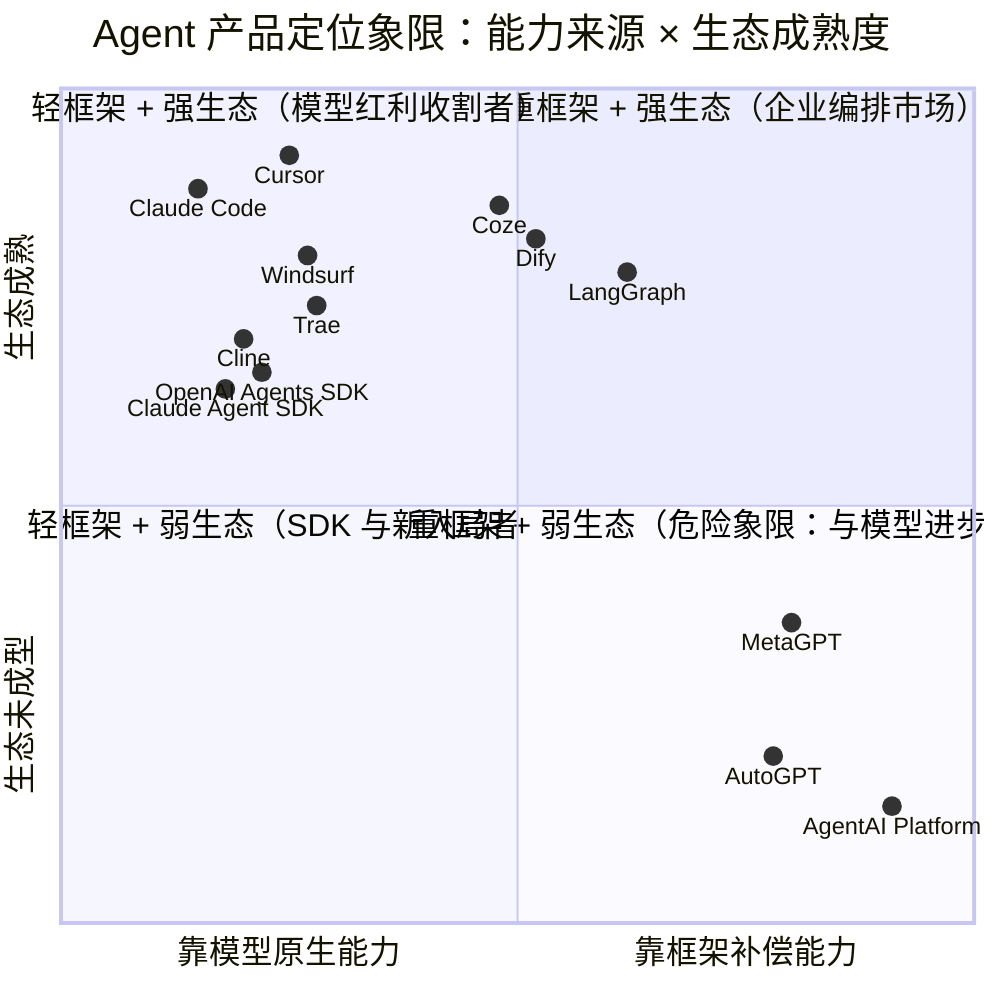
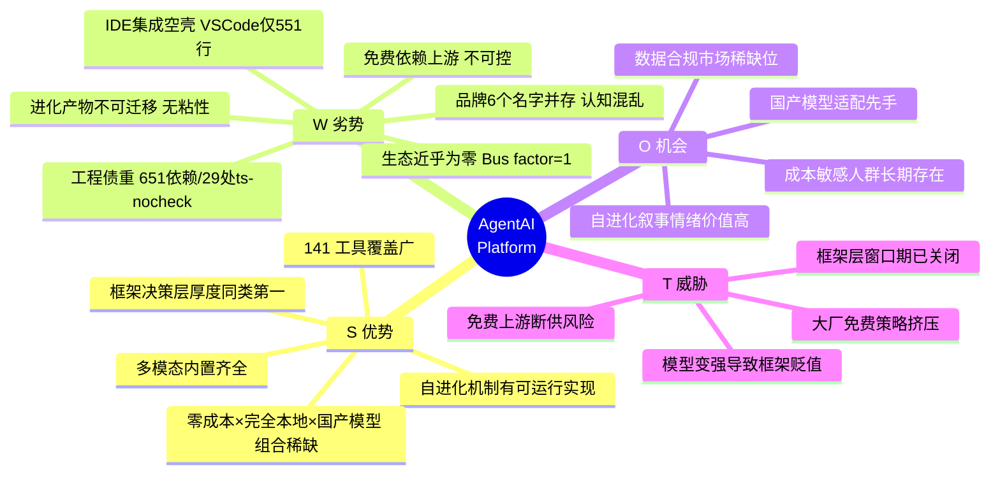
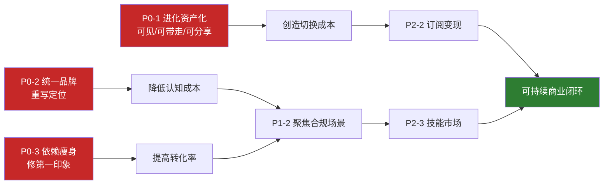

# AgentAI Platform — 产品前景与竞品能力分析报告

> 分析人：许清楚（产品经理）
> 日期：2026-08-05
> 分析对象：F:\agentai-platform（AgentAI Platform / PulseFlow / 岐枢）
> 依据：AGENTS.md、README.md、SYSTEM_CAPABILITIES.md、package.json、gateway 源码实测数据、2026 Q1-Q3 市场公开信息

---

## 摘要（先给结论）

这个项目的**技术能力被低估，产品成立性被高估**。

Claude 在 2026-06-21 的判断是"只差一颗更强的大脑"——我认为这个判断只对了一半。真正的瓶颈不是模型，是**它没有回答"谁会在什么时刻选择它而不是别的东西"**。

三个核心判断：

1. **它不是框架，把它当框架卖会输。** 2026 年框架层战争已结束（LangGraph 占开发者心智、Coze/Dify 占国内低代码），而本项目的 Plugin API v1 还在"规划中"、SDK 与文档缺位——它实际是一个**开箱即用的个人 Agent 工作站**，不是给别人搭东西的框架。定位错了，所有竞品对比都会失焦。
2. **免费不是护城河，是租来的护城河。** 核心卖点依赖第三方免费模型额度（agnes / cline 中转）。上游一变，卖点当天蒸发。
3. **自进化是唯一真正的差异化，但目前是"功能"不是"资产"。** 进化产物躺在本地 `~/.agentai/`，不可导出、不可分享、不可交易——用户零迁移成本，构不成护城河。**把它变成资产，是这个项目从 demo 走向产品的唯一转折点。**

---

## 一、产品定位与目标用户

### 1.1 它到底解决谁的什么痛点

先做一个残酷的区分。README 里列的痛点有 8 条，但只有 2 条是**真痛点**（用户愿意为此改变行为），其余是**痒点**（听着好，但不会因此换工具）：

| README 声称的痛点 | 真实性判定 | 理由 |
|---|---|---|
| 不想每月交 $20 | 🔴 **真痛点** | 国内独立开发者/学生对 $20/月 的心理门槛极高，且支付渠道有摩擦。这是最硬的需求 |
| 数据不出机器 | 🔴 **真痛点** | 政企、外包、涉密项目的硬约束，不是偏好问题 |
| 跨会话记忆 | 🟡 痒点 | 好用，但 Cursor Rules / CLAUDE.md / AGENTS.md 已经做了 80%，且是行业标配 |
| 自我进化 | 🟡 痒点（但有潜力） | 用户感知弱——AI 变聪明了多少，用户其实说不出来。**除非把进化结果可视化、可导出** |
| 内置多模态（图/视频/3D/TTS） | 🟠 伪痛点 | 写代码的人不会因为能生图而换 IDE。这是**功能堆叠而非需求驱动**，是本项目最大的定位噪音 |
| 中文原生优化 | 🟡 痒点 | 2026 年主流模型中文能力已经很好，差异在缩小 |
| 一次信任永久生效 | 🟢 体验优化 | 好设计，但不构成选择理由 |
| 望闻问切/先诊后治 | 🟠 伪痛点 | 用户要的是"别问废话直接干对"，不是"多问几轮"。**中医叙事对开发者是减分项** |

**结论：真正的痛点只有两个——"零成本"和"数据本地"。** 这两个恰好指向同一类人。

### 1.2 目标用户画像（按优先级重排）

我不认同"独立开发者 / 小企业 / 研究者"这种平铺式描述，那等于没有目标用户。按**获客成本 × 留存概率 × 付费潜力**排序：

| 优先级 | 用户群 | 画像 | 为什么选它 | 为什么不选它 |
|---|---|---|---|---|
| **P0 首要** | **国内成本敏感型个人开发者/学生** | 会写代码、有折腾意愿、不愿或不便付 $20/月、对国产模型无偏见 | 免费 + 中文 + 开箱即用 + 不用配 Key | Cursor 学生免费、Trae 国内免费，**这个池子正在被大厂免费策略抽干** |
| **P1** | **数据不能出内网的开发者** | 政企外包、涉密项目、金融/医疗研发 | 完全本地 + 审计日志 + 沙箱分级 + Apache 2.0 | 缺信创资质、缺私有化部署文档、缺 SLA |
| **P2** | **Agent 技术爱好者 / 研究者** | 想看"元认知+自进化"怎么实现，Fork 来改 | 决策层实现完整、代码可读、原创概念多 | 5026 行的主循环 + 29 个 `@ts-nocheck`，二次开发门槛高 |
| **P3 存疑** | 小企业 | 想省钱做内部 Agent | 免费 | **没有多租户、没有权限体系、没有运维支持，企业不敢用** |

> **给主理人的直言**：P3（小企业）现在不是你的用户，硬做会分散资源。P0 是你的现金流基础盘，但**这个池子正在被 Trae/Coze 的免费策略挤压**。P1 是你唯一能建立防御的方向——因为大厂的免费产品普遍要联网。

### 1.3 框架 vs 应用：本质区别与本项目的真实位置

这是本报告最重要的定位判断。

**框架的判定标准**（不是自称，是能力事实）：
- ✅ 有稳定的扩展 API 和版本承诺 → ❌ 本项目 Plugin API v1「规划中」
- ✅ 有文档站和 quickstart → ❌ 本项目 VitePress 文档站「规划中」
- ✅ 能被别人 import 进自己的项目 → ❌ 本项目 `gateway` 是可执行运行时，不是可嵌入的库
- ✅ 生态有第三方贡献 → ❌ 212 次提交，实质单人项目

**应用（工作站）的判定标准**：
- ✅ 装完就能用 → ✅ `pnpm dev` 打开就能聊
- ✅ 有完整 GUI → ✅ 102 个前端组件、15 个功能页
- ✅ 多端交付 → ✅ Web / Tauri / QQ / VSCode
- ✅ 端到端解决场景 → ✅ 141 工具覆盖文件/浏览器/桌面/多模态

**判定：这是一个伪装成框架的应用。**

这不是坏事——**应用比框架更容易活下来**（框架要生态，应用只要用户）。但必须承认，然后调整所有对外叙事：

> ❌ 现在的叙事："完全免费的智能体框架平台"
> ✅ 应该的叙事："**你的本地 AI 工作站——不花钱、不联网、越用越懂你**"

### 1.4 核心价值主张是否成立

| 价值主张 | 成立性 | 判定理由 |
|---|---|---|
| 免费可用 | ⚠️ **条件成立** | 成立，但依赖上游第三方额度，**不可控** |
| 256K/512K 免费上下文 | ✅ **成立** | 长上下文 + 工作记忆摘要，长任务不断线，这是真实体验差异 |
| 多模型路由不中断 | ✅ **成立** | 5 维评分 + 熔断 + 降级，工程质量确实是生产级设计思路 |
| 自进化 | ⚠️ **半成立** | 机制存在（`evolve_prompt`/`model-distiller`/`skill-evolver`/`skill-dna`），但**用户感知不到、产物不可迁移** |
| 框架决策层 | ⚠️ **半成立** | 实现完整，但 Claude 已指出多模块注入冲突；**且这层的价值随模型变强而递减** |
| 多端覆盖 | ⚠️ **表面成立** | Web/Tauri 真实，VSCode 扩展仅 551 行（空壳），QQ Bot「生产适配中」 |
| 多模态内置 | ✅ 成立但错位 | 能力真实，但**与核心用户的核心场景不匹配** |

---

## 二、核心竞争力拆解（逐项护城河判定）

护城河的判定标准只有一个：**竞品复制它需要多久，以及用户离开的成本有多高。**

### 2.1 免费 + 256K/512K 上下文

**真实价值：** 高。这是唯一能让用户**立刻**产生"我赚了"感觉的点。长上下文对 Agent 尤其关键——上下文不够 = 长任务必然失败，这是硬约束不是体验优化。

**但要拆穿一件事：** 免费模型的"免费"不是本项目提供的，是上游给的。项目做的是**接入和调度**，不是**供给**。

| 分析 | 结论 |
|---|---|
| 竞品复制成本 | **极低**。任何人接同样的免费 API 只要 1 天 |
| 用户离开成本 | **零**。哪里免费去哪里 |
| 可控性 | **不可控**。上游限流/收费/关停，卖点当天归零 |

> 🔴 **护城河判定：不构成护城河。这是获客钩子，不是防御工事。**
>
> 更危险的是：它构成**单点故障**。建议立即做上游依赖的冗余方案和"降级也能用"的兜底体验（比如本地小模型 ollama 兜底）。

### 2.2 多模型路由 + 熔断降级 + 无密钥提示

**真实价值：** 中高。这是**工程品味**的体现，不是能力的体现。"免费用完自动切商用、商用无 Key 提示用户、全链路不中断"——这个设计确实优于大部分开源项目的"报错了自己看"。

但从产品视角：**这是一个用户注意不到的优点。** 路由做得好，用户的感受是"它没坏"；做得不好，用户的感受是"这什么破玩意"。它是**卫生因素（hygiene factor）**，不是**激励因素（motivator）**。

| 分析 | 结论 |
|---|---|
| 竞品复制成本 | 中。LiteLLM / OpenRouter 已经把这件事产品化了，接一下就有 |
| 用户离开成本 | 低 |
| 差异化 | 5 维评分 + 6 步修复管道确实比同类精细，但**用户不会为此付费** |

> 🟡 **护城河判定：不构成护城河，但构成"不被淘汰"的门槛。** 建议：不要在营销上强调它，要在稳定性上依赖它。

### 2.3 自进化骨架（蒸馏 / 技能进化 / SkillDNA）

这是我认为**唯一有护城河潜力**的能力。

源码实证（已核实）：
- `model-distiller.ts` — 从 `evolution.jsonl` 提取成功模式 → 聚类 → 蒸馏为 `distilled_patterns` → 回注 system prompt 的 implicit_rules。**这是真正的"小模型继承大模型经验"闭环**，不是 PPT。
- `skill-evolver.ts` — fitness score = 使用次数 × 平均评分；连续 10 次评分 <3 自动 deprecated；重叠 >70% 建议合并；SkillOpt 风格验证门控（只有严格提升才接受修改）。**有拒绝编辑缓冲区和学习率预算，设计思路是对的。**
- `skill-dna.ts` — 技能拆解为可复用/重组/继承/变异的 DNA 片段，新技能通过"杂交"生成。**概念原创度高。**

**为什么它现在还不是护城河：**

| 维度 | 现状 | 问题 |
|---|---|---|
| 产物存储 | `~/.agentai/evolution/*.jsonl` 本地文件 | 换机器归零，用户**零迁移成本** |
| 产物可见性 | 无 UI 展示进化了什么 | 用户**感知不到价值**，不会因此留下 |
| 产物流动性 | 不可导出、不可分享、不可交易 | **无网络效应** |
| 效果验证 | 无 A/B 对照，不知道进化后是否真的更好 | **无法证明价值**，营销上说不硬 |

> 🟢 **护城河判定：目前不构成，但这是唯一可以做成护城河的东西。**
>
> **转折点在于把"进化"从功能变成资产：**
> 1. 进化产物云同步 → 用户换机器不丢 → **切换成本上升**
> 2. 进化产物可视化（"本周 AI 学会了 7 条新规则"）→ **感知价值**
> 3. 进化产物可分享/可交易（对接已有的 `skill-market`）→ **网络效应**
>
> 做到这三步，自进化才从"炫技"变成"用户资产 + 平台粘性"。**这是本报告的第一建议。**

### 2.4 框架决策层（元认知 / 置信度 / 歧义检测 / 自主修复）

**能力事实：** 确实丰富。元认知决策（stop/ask_human/continue/switch_strategy）、5 维置信度评估、4 类歧义模式检测、8 种自主修复模式——Claude 说"在开源 Agent 框架中极为少见"是准确的。

**但产品视角有一个必须说破的问题：**

> **这层的本质是"用框架的复杂度补偿模型的能力缺口"。而模型每 6 个月变强一次，这层的边际价值在持续递减。**

时间线对比：
- **2023 年**：GPT-3.5 时代，模型不会规划、不会反思、经常胡乱调工具 → 框架补偿层价值**极高**（AutoGPT 一夜爆红就是这个原因）
- **2026 年**：Claude / GPT 的原生 agentic loop 已内置规划、自我修正、工具选择、长程一致性 → 框架补偿层价值**大幅下降**

而 AutoGPT 的衰落正是这个规律的实证——**它没有被竞品打败，是被模型进步淘汰的。**

更糟的是 Claude 已指出的副作用：歧义检测、置信度检查、自主修复、元认知决策**同时注入 `[SYSTEM]` 指令**，弱模型会收到多条互相矛盾的指令。这意味着：

**框架越"聪明"，弱模型表现越差** —— 与设计初衷完全相反。而本项目的默认用户恰恰在用弱模型（免费模型）。

> **⚠️ 论证修正（经架构师 software-architect 复核，2026-08-05）**
>
> 我最初的判断是"决策层始终全开、对强模型是纯 token 浪费"。**这一半不成立，必须更正。**
>
> 实测 `agentai-loop.ts` 已有三档能力分级 `_capabilityTier: autonomous | guided | supervised`（行 406），并有静态分级 + 运行时动态覆盖（行 1522-1534）。约 10 处 `if (this._capabilityTier !== 'autonomous')` 已把重补偿整体跳过——**强模型（autonomous 档）事实上已经在走轻框架路径**（行 3718 置信度评估仅对非自主模型生效、行 2444 autonomous 档用全量工具不过滤）。
>
> 所以真实情况是：
> - **autonomous（强模型）**：✅ 已轻量化，无浪费问题
> - **guided（中档）**：⚠️ 仅精简了 prompt（行 737），**补偿逻辑仍全开** ← 真正的缺口
> - **supervised（弱模型，即本项目默认场景）**：🔴 全量补偿全开 ← **矛盾注入的真痛点在这里**
>
> **修正后的结论：问题不是"对强模型浪费"，而是"对弱模型伤害"。** 而弱模型恰恰是本项目免费策略下的默认场景——**这让问题的产品严重性不降反升**。

| 分析 | 结论 |
|---|---|
| 竞品复制成本 | 中高（工程量大） |
| 用户离开成本 | 低 |
| **趋势** | 🔴 **价值随时间递减** |

> 🔴 **护城河判定：不构成护城河，且是战略风险敞口。**
>
> 建议：把补偿层从"tier 硬编码 if 判断"改为**数据化配置**，重点治理 guided/supervised 两档的模块级开关。架构师评估此项**仅 1-2 人日、低风险**（基础设施已存在，是收敛而非新建）——**成本远低于我最初的预估**，见 P1-1。

### 2.5 多端覆盖（Web / 桌面 / QQ / VSCode）

**实测数据：**

| 端 | 状态 | 实测 |
|---|---|---|
| Web GUI | ✅ 成熟 | 102 个组件，15 个功能页 |
| Tauri 桌面 | 🟡 可用 | 三平台打包「进行中」 |
| QQ Bot | 🟠 半成品 | 「生产适配中」 |
| VSCode 扩展 | 🔴 **空壳** | `extension.ts` 404 行 + `gateway-client.ts` 147 行 = **551 行**。对比：真正的 IDE Agent 扩展在万行量级 |

**产品判断：** "四端一体"目前是**营销话术而非产品事实**。而且——

> **多端本身不产生价值，多端×同一份记忆才产生价值。**

真正有杀伤力的叙事是："在 VSCode 里教它的规则，QQ 里问它它也记得。"但这需要**跨端统一记忆**已经打通并被验证。项目有 `channel-session-bridge.ts`，方向对，但没有对外讲清楚。

> 🟡 **护城河判定：不构成护城河。目前是资源分散点而非优势点。**
>
> 建议：**砍到两端**（Web + 桌面），把 VSCode 和 QQ 降级为实验性。四个半成品不如两个精品。

### 2.6 竞争力总览

| 能力 | 真实强度 | 护城河 | 趋势 |
|---|---|---|---|
| 免费 + 长上下文 | ★★★★☆ | ❌ 否（且是单点故障） | ↘ 大厂免费策略挤压 |
| 多模型路由熔断 | ★★★★☆ | ❌ 否（卫生因素） | → 持平 |
| **自进化骨架** | ★★★☆☆ | ⚠️ **有潜力，未兑现** | ↗ **唯一可上升项** |
| 框架决策层 | ★★★★☆ | ❌ 否 | ↘ **随模型进步贬值** |
| 多端覆盖 | ★★☆☆☆ | ❌ 否 | → 半成品状态 |
| 本地优先/数据不出机 | ★★★★☆ | ⚠️ 有潜力 | ↗ 合规需求上升 |
| 多模态内置 | ★★★☆☆ | ❌ 否 | ↘ 与核心场景错位 |

---

## 三、竞品能力对比矩阵

### 3.1 竞品分层认知

先明确一件事：**这些竞品不在同一个战场**，混在一张表里比会失真。分三层看：

- **L1 交付层（用户直接用的产品）**：Cursor / Windsurf / Trae / Claude Code / Cline / Coze / Dify
- **L2 框架层（开发者拿来搭东西）**：LangChain(LangGraph) / AutoGPT / MetaGPT / OpenAI Agents SDK / Claude Agent SDK
- **AgentAI Platform 的真实位置：L1（交付层），但用 L2（框架层）的语言在自我描述** ← 这就是定位错位的根源

### 3.2 全维度能力对比矩阵

评分：★=弱 / ★★=一般 / ★★★=合格 / ★★★★=强 / ★★★★★=行业标杆

| 维度 | **AgentAI Platform** | Cursor / Windsurf | Trae | Claude Code / Cline | LangChain (LangGraph) | AutoGPT | MetaGPT | Dify / Coze | OpenAI / Claude Agent SDK |
|---|---|---|---|---|---|---|---|---|---|
| **模型质量（默认体验）** | ★★ 免费模型为主，够用但弱 | ★★★★★ Claude/GPT 顶配 | ★★★★ 国内免费+强模型 | ★★★★★ Claude 原生 | ★★★★ 自带 Key | ★★★ 自带 Key | ★★★ 自带 Key | ★★★★ 多模型接入 | ★★★★★ 官方原生 |
| **IDE 集成深度** | ★★ Web+Tauri，VSCode 扩展仅 551 行 | ★★★★★ 编辑器原生 | ★★★★★ 编辑器原生 | ★★★★ 终端+IDE 插件 | ★ 无 | ★ 无 | ★ 无 | ★ 无（Web） | ★ 无（SDK） |
| **框架智能度（决策层厚度）** | ★★★★★ **本项目最强项** | ★★★ 靠模型 | ★★★ 靠模型 | ★★★ 靠模型 | ★★★★ 图编排/状态机 | ★★★★ 早期开创者 | ★★★★ SOP 驱动 | ★★★ 工作流编排 | ★★★ 薄封装 |
| **自进化能力** | ★★★★ **蒸馏+DNA+进化门控，同类罕见** | ★★ Rules/Memory | ★★ Rules | ★★★ CLAUDE.md+Skills | ★★ 需自建 | ★★ 早期尝试 | ★★ | ★ | ★★ Memory API |
| **多端覆盖** | ★★★ 四端但两端半成品 | ★★ IDE only | ★★ IDE only | ★★★ CLI+IDE | ★ 库 | ★ | ★ | ★★★ Web+API | ★ SDK |
| **成本 / 免费度** | ★★★★★ **开箱零成本** | ★★ $20/月 | ★★★★ 国内免费策略 | ★★ 按量付费 | ★★★ 框架免费/模型自费 | ★★★ 同左 | ★★★ 同左 | ★★★★ 社区版免费 | ★★★ SDK 免费/模型自费 |
| **可扩展性（第三方能否扩展）** | ★★ Plugin API 未定版，无 SDK/文档站 | ★★★ MCP+扩展 | ★★★ MCP | ★★★★ MCP+Skills 生态 | ★★★★★ 生态最全 | ★★★ | ★★★ | ★★★★ 插件市场成熟 | ★★★★ 标准清晰 |
| **生态成熟度** | ★ **212 commits，实质单人项目** | ★★★★★ | ★★★★ | ★★★★★ | ★★★★★ 开发者规模最大 | ★★★ 已衰落 | ★★★ | ★★★★★ 国内低代码双雄 | ★★★★★ |
| **工程稳健度** | ★★ 29 个 `@ts-nocheck`、651 个根依赖、主循环 5026 行 | ★★★★★ | ★★★★ | ★★★★★ | ★★★★ | ★★★ | ★★★ | ★★★★ | ★★★★★ |
| **数据本地/隐私** | ★★★★★ **完全本地，真实优势** | ★★ 云端 | ★★ 云端 | ★★★ 本地执行+云模型 | ★★★★ 自部署 | ★★★★ | ★★★★ | ★★★★ 可私有化 | ★★ |
| **中文/国产模型适配** | ★★★★★ deepseek/智谱/商汤/longcat 原生 | ★★ | ★★★★★ | ★★★ | ★★★ | ★★ | ★★★ | ★★★★★ | ★★ |
| **多模态内置** | ★★★★★ 图/视频/3D/TTS/音乐 | ★ | ★★ | ★★ | ★★★ 需自接 | ★ | ★ | ★★★★ | ★★★ |
| **上手门槛** | ★★★★ 免 Key 开箱即用 | ★★★★★ | ★★★★★ | ★★★★ | ★★ 需编码 | ★★ | ★★ | ★★★★★ 拖拽 | ★★ 需编码 |

### 3.3 优劣势提炼

**AgentAI 明确领先的（3 项）**
1. **框架决策层厚度** —— 元认知/置信度/歧义检测/8 种自主修复，同类开源项目无出其右
2. **自进化机制完整度** —— 蒸馏 + SkillDNA + 进化门控，概念原创且有可运行实现
3. **零成本 × 完全本地 × 国产模型原生** —— 这个**组合**没有第二家同时满足

**AgentAI 明确落后的（4 项）**
1. **生态成熟度**（★ vs 竞品 ★★★★+）—— 差距最大，且最难追
2. **模型质量**（默认体验）—— 免费模型 vs Claude/GPT，这是体感差距的根源
3. **IDE 集成深度** —— 551 行的 VSCode 扩展 vs 编辑器原生
4. **工程稳健度** —— 651 个根依赖 + 29 个 `@ts-nocheck` 会直接劝退潜在贡献者

### 3.4 定位象限图

**横轴：能力来源** —— 靠模型原生能力（左） ←→ 靠框架补偿能力（右）
**纵轴：生态成熟度与落地规模** —— 低（下） ←→ 高（上）



**这张图要读出的三件事：**

1. **AgentAI 处在最危险的第四象限（重框架 + 弱生态），而且是最极端的位置。** 它的邻居是 AutoGPT（已衰落）和 MetaGPT（研究向）。这不是巧合——**重框架补偿 + 弱生态 = 靠"模型不够强"这个假设活着**，而这个假设正在被证伪。

2. **所有赢家都在上半区，且大多偏左。** Cursor / Claude Code 的策略是"骑在模型进步上"——模型每变强一次，它们免费获得能力提升。AgentAI 的策略是"补偿模型的弱"——模型每变强一次，它的框架价值就贬值一点。**这是方向性的差异，不是程度差异。**

3. **可行的迁移路径是向上（补生态），不是向左（削框架）。** 削框架会丢掉唯一的技术资产；向上补生态才能把已有的框架能力变现。而"向上"对单人项目最现实的路径不是拼社区规模，而是**把用户的进化资产沉淀下来形成局部网络效应**（详见第五章 P0 建议）。

---

## 四、前景判断

### 4.1 机会（Opportunities）

| 机会 | 强度 | 说明 |
|---|---|---|
| **国内成本敏感市场的持续存在** | ★★★★ | $20/月对国内个人开发者仍是显著门槛，且支付渠道有摩擦。零成本永远有人要 |
| **数据合规需求上升** | ★★★★★ | 政企/金融/医疗对"数据不出内网"是硬约束。**完全本地运行 + 审计日志 + Apache 2.0 是稀缺组合**，这是最被低估的机会 |
| **国产模型崛起红利** | ★★★★ | DeepSeek/智谱/通义在推理与性价比上快速追赶，本项目已原生适配 8 家 Provider，占了先手 |
| **自进化叙事的稀缺性** | ★★★★ | 市场上讲"Agent 会自己变聪明"且有可运行实现的极少。**这是唯一能讲出情绪的故事**（"越用越懂你"比"支持 141 个工具"有力一百倍） |
| **产业焦点从"选框架"转向"怎么落地"** | ★★★ | 2026 Q1 信号明确。这对本项目**既是机会也是威胁**——机会在于它是能落地的完整产品，威胁在于它一直在用框架语言自我描述 |

### 4.2 威胁（Threats）

| 威胁 | 强度 | 说明 |
|---|---|---|
| **模型原生 Agent 能力持续增强** | ★★★★★ | **最致命**。框架补偿层的价值随模型进步单调递减，AutoGPT 就是前车之鉴 |
| **免费模型上游断供/限流** | ★★★★★ | **单点故障**。核心卖点建立在别人的免费额度上，不可控 |
| **大厂免费策略碾压** | ★★★★ | Trae 国内免费、Coze 免费额度、腾讯元器免费。**"免费"这个位置正在被大厂占据，而且它们的模型更强** |
| **框架层窗口期已关闭** | ★★★★ | 2026 Q1 框架战争已收敛（LangGraph + Coze/Dify）。**以"框架"身份入场已经晚了两年** |
| **单人项目的可持续性** | ★★★★ | 212 commits 实质单人。**Bus factor = 1**。工程债（651 依赖 / 29 处 `@ts-nocheck` / 5026 行主循环）会让贡献者望而却步，形成"没人来 → 更难维护 → 更没人来"的负循环 |
| **品牌认知混乱** | ★★★★ | 实测：AgentAI 1679 处 / PulseFlow 164 处 / 岐枢 37 处 / altas 31 处 / 岐黄 27 处 / ALTES 8 处 —— **6 个名字并存**。用户在 README 看中医、在 package.json 看多模态、在 AGENTS.md 看框架。**用户根本不知道这是什么产品** |

### 4.3 SWOT 综合



**战略象限结论：**
- **SO（用优势抓机会）**：本地优先 + 审计沙箱 → 主攻**数据合规场景**。这是唯一"大厂做不了"的位置（它们的免费产品必须联网）
- **WO（补短板抓机会）**：修工程地板 + 统一品牌 → 才有资格谈生态
- **ST（用优势防威胁）**：把自进化做成**用户资产**，让价值来自用户积累而非模型能力 → **对冲模型进步带来的框架贬值**
- **WT（收缩防御）**：砍掉半成品端、砍掉与核心场景无关的多模态营销

### 4.4 12-18 个月发展预判

给三个情景和主观概率：

#### 🔵 基线情景（概率 ~60%）— "高质量个人项目"

- 保持单人维护，GitHub 数百 star
- 主理人自用为主，偶有爱好者 Fork
- 免费模型上游变动导致体验周期性波动
- 功能持续增加，工程债同步增加
- 品牌仍在 AgentAI / PulseFlow / 岐枢之间摇摆
- **结局：技术上有价值，产品上未成立。成为一个"值得读源码的项目"而非"值得用的产品"**

#### 🟢 上行情景（概率 ~25%）— "细分场景的小而美"

触发条件（**必须同时满足**）：
1. 品牌统一 + 定位从"框架"改为"本地 AI 工作站"
2. 工程地板修复（依赖瘦身 / 去 `@ts-nocheck` / 主循环拆分）
3. 进化资产云同步 + 可视化 + 可分享
4. 砍到两端，聚焦一个尖锐场景（我建议：**数据不出内网的开发者**）

- 12 个月：几 k star，形成小而活跃的中文社区，出现第一批非主理人贡献者
- 18 个月：技能市场跑通首批交易 / 或拿到第一批政企私有化付费
- **结局：细分市场站住，年营收 10-100 万量级，可持续**

#### 🔴 下行情景（概率 ~15%）— "卖点蒸发"

触发条件（任一）：
- 免费模型上游关停或大幅限流
- Trae/Coze 推出等效的本地化免费方案
- 主理人精力转移

- 核心卖点消失，用户无理由留下（因为**离开成本为零**）
- **结局：项目归档，代码作为技术参考存在**

> **概率解读：上行情景的 25% 几乎完全取决于"是否把自进化做成用户资产"。** 如果不做，上行概率会掉到 10% 以下——因为其他所有优势都是可复制、可替代、随时间贬值的。

### 4.5 商业化可行性

Apache 2.0 + 完全免费 = **不能靠 license 变现**。可行路径按推荐度排序：

| 路径 | 可行性 | 时机 | 我的判断 |
|---|---|---|---|
| **① 进化资产云同步订阅**（¥19-39/月） | ★★★★★ | 6-12 月 | **最推荐**。卖的不是模型能力（会被商品化），是**用户自己积累的资产**。付费理由天然成立："你教了它三个月，换电脑不想重来吧？" 且成本极低（存的是 JSONL，不是算力） |
| **② 企业私有化部署 + 审计合规**（项目制 5-20 万） | ★★★★ | 12-18 月 | 已有 `agentai-audit` 包和沙箱分级基础。政企有真实预算。但需要：部署文档、SLA 承诺、（可能）信创适配 |
| **③ 技能市场抽成** | ★★★ | 18 月+ | `skill-market-client.ts` 已有 pricing 脚手架，方向对。但**先有鸡后有蛋**——没有用户规模就没有交易。**不要现在做** |
| **④ 商用模型 Key 代充/分成** | ★★ | 随时 | 有现金流但毛利薄，且与"免费"心智冲突，可能损害品牌 |
| **⑤ 定制开发/咨询** | ★★★ | 随时 | 现实但不可规模化，会挤占产品时间 |

> **变现节奏建议**：12 个月内不要收费。先把 ①（资产云同步）的**技术闭环和用户感知**做出来免费用，等用户积累到"数据舍不得丢"的程度，再收订阅。**先创造切换成本，再收费。顺序反了就是自杀。**

---

## 五、风险与产品策略建议

### 5.1 风险清单（按对产品成败的影响排序）

| # | 风险 | 严重度 | 类型 | 证据 |
|---|---|---|---|---|
| R1 | **产品定位不清 + 品牌 6 名并存** | 🔴 致命 | 产品 | AgentAI 1679 / PulseFlow 164 / 岐枢 37 / altas 31 / 岐黄 27 / ALTES 8 |
| R2 | **免费模型单点依赖** | 🔴 致命 | 商业 | 核心卖点建立在第三方免费额度上 |
| R3 | **框架补偿层随模型进步贬值** | 🔴 致命 | 战略 | 象限图第四象限，AutoGPT 前车之鉴 |
| R4 | **用户切换成本为零** | 🔴 致命 | 产品 | 进化产物本地存储，不可迁移/分享 |
| R5 | **工程债劝退贡献者** | 🟠 高 | 工程 | 651 个根依赖；**29 个 `@ts-nocheck`，核心链路全中枪**——`llm-router.ts`、`tools.ts`、`routes/chat.ts`（主 API 入口）、`index.ts`（进程入口）；`agentai-loop.ts` 5026 行、`tools.ts` 6731 行。**"typecheck 通过"≠核心链路类型安全** |
| R5b | **重构幻觉：写了新代码但从未接入** | 🟠 高 | **流程** | `loop/` 整个目录 **6 个实现文件 + types.ts，共 7 个文件约 1393 行，全部零外部引用**（含结构干净的 `context-builder.ts` 228 行、`core.ts` 466 行）。运行时仍走 `agentai-loop.ts:691` 的内联版本。**详见下方专项说明** |
| R6 | **弱模型档 `[SYSTEM]` 注入冲突** | 🟠 高 | 技术 | 已核实：autonomous 档已跳过补偿，**问题集中在 supervised/guided 两档——即本项目免费模型的默认场景** |
| R7 | **"30 秒体验"承诺兑现不了** | 🟠 高 | 体验 | 651 个根依赖 → `pnpm install` 慢且易失败 → **第一印象直接崩** |
| R8 | **IDE 集成空壳** | 🟡 中 | 产品 | VSCode 扩展 551 行 |
| R9 | **中医叙事对开发者受众减分** | 🟡 中 | 品牌 | 海外开发者完全 get 不到；国内开发者易判为玄学 |
| R10 | **端到端测试缺失** | 🟡 中 | 工程 | 65 个 `.test.ts`（比 AGENTS.md 所述的"完全没有"要好），但核心 5026 行主循环覆盖存疑 |

> **补充说明 R10**：AGENTS.md 中 Claude 的"缺少端到端测试"判断需要更新——项目实际有 65 个测试文件。但 `src/` 下还混着 9 个 `test-*.ts` 手工脚本（如 `test-skill-market-*.ts`），这些是调试残留不是测试，应清理出 `src/`。另据架构师核实：三个核心巨文件（`tools.ts` / `llm-router.ts` / `routes/chat.ts`）**仍无专属测试**，且 `agentai-loop.test.ts` 自身带 `@ts-nocheck`——**测试本身类型不安全**。

---

#### 🔍 R5b 专项：重构幻觉 —— 本次分析最重要的流程发现

这条是我在复核架构师反馈时挖出来的，**它揭示的不是技术债，是流程病**，重要性高于任何单项技术指标。

**事实（实测，非推断）：**

```
packages/agentai-gateway/src/loop/
├── context-builder.ts    228 行   外部引用数: 0
├── core.ts               466 行   外部引用数: 0
├── directive-manager.ts  131 行   外部引用数: 0
├── reflection.ts         150 行   外部引用数: 0
├── tool-filter.ts        145 行   外部引用数: 0
├── trust-commands.ts      98 行   外部引用数: 0
├── types.ts              175 行   外部引用数: 0
                        ─────────
                        1393 行   全部零引用
```

验证方法与结论：
- `agentai-loop.ts` **不 import `./loop/` 下任何文件**（`grep -n "from './loop/'"` 无结果）
- `loop/core.ts` 虽然 import 了 `context-builder.js`，但 **`core.ts` 自己也零外部引用**——它们互相引用，构成一个自洽但**与主程序完全脱钩的孤岛**
- 运行时实际走的是 `agentai-loop.ts:691` 的私有内联 `buildImmutablePrefix`
- 而真正的生产入口 `routes/chat.ts`、`goal-runner.ts`、`master-controller.ts` 全部 import 的是 `agentai-loop.js`

**为什么这比"5026 行主循环"严重得多：**

有人（很可能是 AI 辅助）已经完成了主循环拆分的**第一阶段**——写出了 1393 行结构干净、职责清晰的模块化代码。然后**停在了最后一步：没有接线，没有删旧代码，没有验证**。旧的 5026 行巨文件继续在生产路径上跑。

这产生三重危害：

| 危害 | 说明 |
|---|---|
| **误导后来者** | 任何人（包括未来的 AI 协作者）看到 `loop/context-builder.ts` 结构良好，会**误判"这层已经模块化了"**，从而在错误的文件上做修改。架构师明确警告了这个陷阱 |
| **双份维护成本** | 同一逻辑两处实现，改一处另一处静默腐化 |
| **虚假进度信号** | README 说"主循环 3400+ 行，特别需要帮助拆分"，实际已涨到 5026 行——**拆分工作看起来做过，实际净负增长** |

**产品视角的判断：**

> 这不是"某个模块没写完"，而是**项目缺少"完成的定义"（Definition of Done）**。
>
> 在 AI 辅助开发下，"产出代码"变得极其廉价，但"接线 + 验证 + 删旧"这三步没有变便宜——它们需要人的判断力。**当产出感取代交付感，项目就会积累大量"看起来完成了的半成品"。**
>
> 这恰好解释了本报告反复观察到的同一个模式：141 个工具但 IDE 集成是 551 行空壳；四端覆盖但两端是半成品；65 个测试但核心三巨头无覆盖；1393 行重构代码但零接入。**功能极多、地板极低，是同一个流程病的不同切面。**

**建议（已并入 P0-4）：** 立即处置 `loop/` 目录——要么接线要么删除，**不允许"先留着"**。并建立一条铁律：**未接入生产路径的代码不允许合并。**

---

### 5.2 产品策略建议

---

#### 🔴 P0 — 决定生死（3 个月内必做）

**P0-1｜把"自进化"从功能做成资产 —— 这是唯一的护城河机会**

这是本报告最重要的一条建议。三步走：

1. **可见**：新增"进化档案"页面，展示"本周学会 7 条规则 / 蒸馏 3 个模式 / 淘汰 2 个低分技能"，让用户**看见 AI 在变强**
2. **可带走**：一键导出 `agent-profile.json`（含 evolved-rules + distilled patterns + skill DNA），换机器一键导入
3. **可分享**：生成分享链接，别人可导入你的"AI 人格"

> **为什么这是 P0**：它同时解决 R3（对冲模型进步贬值——因为价值来自用户积累而非模型）和 R4（创造切换成本），并且直接铺垫了商业化路径 ①。**没有这一条，其他所有努力都是在优化一个用户随时可以零成本离开的产品。**

**P0-2｜统一品牌 + 重写定位叙事**

- 六选一，全仓库替换（建议保留 **PulseFlow** 作对外品牌，`AgentAI` 作技术命名空间，**彻底删除** 岐枢/岐黄/ALTES/altas）
- 一句话定位改为：**"你的本地 AI 工作站——不花钱、不联网、越用越懂你"**
- **README 重写**：把中医叙事从开头移到"设计理念"附录。开发者要在 10 秒内知道"这能帮我干什么"，而不是先读《黄帝内经》
- 删除"框架"自称，改用"工作站/平台"

> **为什么这是 P0**：现在任何人打开这个项目，第一反应是"这是个什么东西"。**认知成本 = 转化率杀手。** 而这一条几乎零技术成本，纯执行力问题。

**P0-3｜修复"第一印象"——依赖瘦身**

- 根 `package.json` 的 651 个 dependencies 是 `node_modules` 泄漏进来的，**必须清理**，只保留真实直接依赖（预计 <20 个）
- 目标：`pnpm install` 在干净环境 < 2 分钟成功
- 加一条 CI：干净容器里跑 `git clone && pnpm install && pnpm dev`，跑不通就红

> **为什么这是 P0**：README 承诺"30 秒体验"，但 651 个依赖让新用户大概率在第一步就失败。**获客漏斗最顶端的漏水，修一次收益最大。**

**P0-4｜处置 `loop/` 死代码分支 + 建立"完成的定义（Definition of Done）"**

- 经架构同学复跑核验：`packages/agentai-gateway/src/loop/` 下 6 个文件（context-builder / core / directive-manager / reflection / tool-filter / trust-commands，约 1393 行）**零外部引用**——主循环 `agentai-loop.ts` 不 import 其中任何文件，生产入口（chat 路由、goal-runner、master-controller）也都只走 `agentai-loop.js`。也就是说，这块"完整的决策循环"从未接上生产路径，是**写了但没接上**的伪完成。
- 二选一，先决策再动手：
  - **A. 删除**：确认无价值后整体移除，README/AGENTS.md 中关于"决策循环模块"的描述同步删掉，避免二次误导。
  - **B. 接入**：若确有价值，先写端到端测试证明它能跑通，再挂到主循环的真实分支上——但这是 3-5 人日，且**不要单独立项**，建议并入 P1-1 的补偿层改造一并做。
- **更关键的是流程病**：为什么会有一段 1393 行、自洽却无引用的代码安静存在？说明团队缺"完成的定义"。建议在 AGENTS.md 加一条铁律：**"未接入生产路径（无 import、无测试覆盖、无端到端验证）的代码不允许合并。"** 这比删这段死代码本身重要一个量级。
- 顺手修一处事实错误：README 自称主循环"3400+ 行"，实际 `agentai-loop.ts` 约 **5026 行**（AGENTS.md 已记录），对外口径统一。

> **为什么这是 P0**：死代码不会立刻崩，但它会**污染所有后续判断**——竞品评估、能力盘点、重构规划都会基于"存在但没用"的东西。越早清，越便宜。

---

#### 🟠 P1 — 决定天花板（3-6 个月）

**P1-1｜补偿层按 tier 数据化配置（重要更正）**

> ⚠️ **架构同学指正后的更正**：我在初稿里写"强模型下决策层全量常开会浪费 token、要新增能力档位开关"——**这是错的**。代码里 `_capabilityTier: 'autonomous' | 'guided' | 'supervised'` **已经存在**（`agentai-loop.ts:406`），且 autonomous tier 在 `:737` 已用 `useLitePrompt = tier !== 'supervised'`、`:808` 已用 `if (autonomous)` 跳过补偿逻辑。也就是说"强模型省补偿"**已实现**，不是缺口。真实缺口在 **guided / supervised 两档**：它们的补偿是硬编码散落各处（`confidenceEstimator`、歧义检测、`[SYSTEM]` 注入），没有统一开关，难以按模型做精细调节。

- 任务落点从"新增档位"改为"**把现有补偿逻辑改成按 tier 数据化配置**"：抽一张 `isCompensationEnabled(tier, module)` 配置表，把散落的补偿开关收口，而不是再写一套新机制。
- 同时把多个 `[SYSTEM]` 注入**合并为单一决策点**（解决 R6 注入冲突）——这一步仍然成立，并入此处。
- 工作量：**1-2 人日**，低风险（纯配置化，不动主循环语义），可独立交付。
- **⚠️ 伪完成陷阱提醒**：若发现 `loop/` 那段死代码有复用价值，应**依附本项一并接入**（验证它能跑通后挂到真实分支），**不要单独拉一个 3-5 人日的"决策循环重构"项目**——那会重蹈"写了没接上"的覆辙。

> 价值：框架的补偿价值不再随模型进步归零（弱模型仍需补偿），且强模型下本就走轻路径，体验已最优，无需再"改"。

**P1-2｜聚焦单一尖锐场景：数据不出内网的开发者**

- 这是**大厂结构性做不了**的位置（它们的免费产品必须联网）
- 交付物：私有化部署一键包 + 本地模型（ollama）兜底 + 审计报告导出
- 顺带解决 R2（免费上游断供时，本地模型兜底保证"至少能用"）

**P1-3｜端策略收缩：四端 → 两端**

- 保留 Web + Tauri 桌面，做深
- VSCode / QQ 明确标注为 experimental，停止投入
- 把省下的资源全部投入 P0-1

**P1-4｜工程地板抬高**

- 消除 29 个 `@ts-nocheck`（架构同学复跑实测值，含 2 个 `.test.ts`），优先核心链路（`llm-router.ts` 必须先做）
- `agentai-loop.ts`（5026 行）按职责拆分为 5-8 个模块
- `src/` 下 9 个 `test-*.ts` 手工脚本移出到 `scripts/` 或删除
- 为核心链路（路由/工具分派/上下文构建）补端到端测试

---

#### 🟡 P2 — 长期建设（6-18 个月）

**P2-1｜Plugin API v1 定版 + 文档站上线** — 有了它才谈得上"框架"和第三方生态
**P2-2｜进化资产云同步商业化** — 在 P0-1 的技术闭环上叠订阅（¥19-39/月）
**P2-3｜技能市场开放交易** — 等用户规模到位后再启动，抽成 15-30%
**P2-4｜效果可证明** — 建立进化前后的 A/B 基准（同一批任务，开进化 vs 关进化，成功率对比）。**没有数据的"越用越强"是营销话术，有数据的才是产品事实**

---

### 5.3 建议优先级速查



---

## 附：一句话产品总结

> **AgentAI Platform 是一台造得过于精密的发动机，装在一辆还没想好开去哪里的车上——它的自进化骨架是真资产，但只有当"进化"变成用户带得走、分享得出去的东西，这个项目才会从"值得读源码的技术样本"变成"离不开的产品"。**

如果只能记住一句执行建议：

> **别再加功能了。把已经会自我进化的那部分，变成用户舍不得丢的东西。**

---

### 附录：本报告的关键实测数据

| 项目 | 实测值 | 来源 |
|---|---|---|
| gateway TS 文件数 | 395 | `find packages/agentai-gateway/src -name "*.ts"` |
| `agentai-loop.ts` 行数 | 5026 | `wc -l` |
| `tools.ts` 行数 | 6731 | `wc -l` |
| `llm-router.ts` 行数 | 2067（且带 `@ts-nocheck`） | `wc -l` + `head` |
| 带 `@ts-nocheck` 的文件 | 29（含 2 个 `.test.ts`） | `grep -rl` |
| 真实测试文件（`.test.ts`） | 65 | `find` |
| `src/` 下手工调试脚本 | 9 | `find -name "test-*.ts"` |
| VSCode 扩展总行数 | 551 | `wc -l` |
| GUI 组件数 | 102 | `ls components/` |
| Python 技能目录 | 37 | `ls agentai-skills/` |
| 根 `package.json` 依赖数 | **651** dependencies + 16 devDependencies | `node -e` |
| Git 提交数 | 212（最近全为 CI 修复） | `git log` |
| 品牌名出现次数 | AgentAI 1679 / PulseFlow 164 / 岐枢 37 / altas 31 / 岐黄 27 / ALTES 8 | `grep -ri` |

*数据采集时间：2026-08-05*
