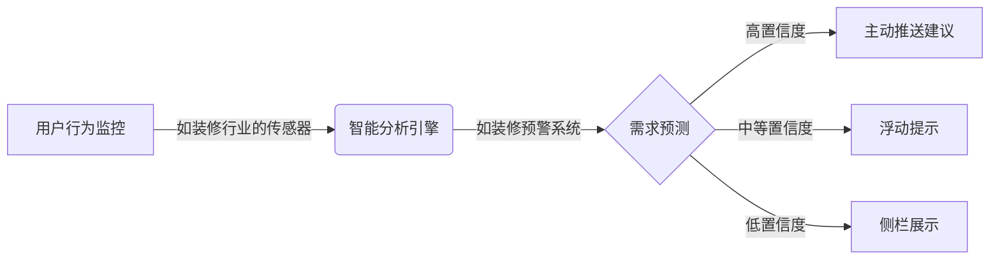

# 🚀 主动建议系统优化解决方案

**问题**: 主动建议不主动、用户看不到
**目标**: 实现真正的主动推送机制
**理念**: 借鉴装修行业的"智能监控+主动预警"思维

---

## 🔍 当前问题深度分析

### 📉 问题表现

**1. 被动展示机制**
```typescript
// 当前: 用户需要主动打开面板
<ProactiveSuggestionsPanel />
```

**2. 缺乏视觉吸引力**  
- 建议面板位于右侧栏，角落位置不显眼
- 没有未读建议的徽章提醒
- 建议数量变动无动画反馈

**3. 不主动推送**
- SSE实现了数据推送，但没有结合UI交互
- 用户可能根本不知道有新建议
- 缺乏装修行业的"实时监控"理念

### 🧠 核心痛点

**装修行业启发**:
- 装修管理系统通过传感器主动收集数据
- 实时发现问题并主动预警
- 多方协同，信息及时同步

**当前系统缺失**:
- 没有"传感器"来监控用户需求
- 没有"预警机制"来提醒用户
- 没有"协同推送"让用户感知建议存在

---

## 💡 解决方案设计

### 🎯 理念升级：从被动到主动

借鉴装修行业智能监控思维：



### 🔧 三层主动推送机制

#### 层级1: 嵌入式对话流推送

**原理**: 在对话中智能插入建议引用
**装修行业对应**: 实时进度监控数据显示

```typescript
// 在对话流程中注入建议
if (userAskedAboutOptimization && hasRelevantSuggestions) {
  return {
    message: userMessage,
    suggestions: [optimizationSuggestions],
    // 如装修系统的实时监控面板
    embedded: true 
  }
}
```

**实现效果**:
```
用户: "这个项目如何优化性能？"
AI: "我来帮您分析性能瓶颈..."
    📊 [检测到3个性能优化建议]
    🎯 建议1: Bundle分析工具集成
    ⚡ 建议2: 代码分割优化
    🚀 建议3: 缓存策略升级
```

#### 层级2: 浮动弹窗智能推送

**原理**: 基于装修行业的主动预警机制
**装修行业对应**: AI视觉监控发现问题主动报警

```typescript
// 浮动弹窗触发逻辑
const triggerFloatingSuggestion = (suggestion: Suggestion) => {
  if (suggestion.urgency > 0.8 && suggestion.confidence > 0.7) {
    // 高优先级建议主动浮窗
    showFloatingCard({
      type: 'urgent',
      title: '🔥 重要建议待处理',
      content: suggestion.title,
      action: '立即查看'
    });
  }
}
```

**浮动弹窗类型**:
- 🔥 **紧急型**: 红色边框+闪烁动画（如装修质量预警）
- ⚡ **重要型**: 黄色背景+脉冲效果（如成本超支提醒）  
- 💡 **推荐型**: 蓝色边框+渐变动画（如效率优化建议）

#### 层级3: 侧栏视觉增强

**原理**: 借鉴装修管理系统的直观数据展示
**装修行业对应**: 实时数据面板+状态指示器

```
侧栏增强效果:
[💡 建议中心] ← 带未读数量徽标
   ├─ 🔥 紧急 (2)
   ├─ ⚡ 重要 (5) 
   └─ 💡 推荐 (12)
```

### 🎨 UI交互优化

#### 1. 装修风格的状态指示器

```css
/* 借鉴装修进度监控的视觉设计 */
.suggestion-status {
  /* 紧急建议 - 如装修质量预警 */
  &.urgent {
    border-left: 4px solid #ff4d4f;
    background: linear-gradient(135deg, #fff2f0, #ffffff);
    animation: pulse-red 2s infinite;
  }
  
  /* 重要建议 - 如成本监控 */
  &.important {
    border-left: 4px solid #faad14; 
    background: linear-gradient(135deg, #fffbe6, #ffffff);
  }
  
  /* 推荐建议 - 如优化建议 */
  &.recommended {
    border-left: 4px solid #1890ff;
    background: linear-gradient(135deg, #f0f5ff, #ffffff);
  }
}

@keyframes pulse-red {
  0%, 100% { box-shadow: 0 0 0 0 rgba(255, 77, 79, 0.4); }
  50% { box-shadow: 0 0 0 10px rgba(255, 77, 79, 0); }
}
```

#### 2. 装修风格的进度指示

```typescript
// 建议采纳进度条 - 类似装修进度监控
const SuggestionProgress = ({ suggestion }) => {
  return (
    <div className="suggestion-progress">
      <div className="progress-header">
        <span>建议执行进度</span>
        <span className="progress-percentage">{suggestion.progress}%</span>
      </div>
      <div className="progress-bar">
        <div 
          className="progress-fill" 
          style={{ width: `${suggestion.progress}%` }}
        />
      </div>
      <div className="progress-stages">
        <span className={suggestion.stage >= 1 ? 'completed' : ''}>分析</span>
        <span className={suggestion.stage >= 2 ? 'completed' : ''}>设计</span>
        <span className={suggestion.stage >= 3 ? 'completed' : ''}>执行</span>
        <span className={suggestion.stage >= 4 ? 'completed' : ''}>验证</span>
      </div>
    </div>
  );
}
```

### 🔮 智能推送策略

#### 装修行业启发的推送算法

```typescript
class ProactivePushEngine {
  // 监控"装修传感器"数据
  private sensors = {
    userActivity: new UserActivitySensor(),
    workspaceChanges: new WorkspaceSensor(),
    conversationContext: new ConversationSensor()
  };
  
  async evaluatePushTiming(user: User, context: Context): Promise<PushStrategy> {
    const scores = {
      conversation: await this.checkConversationOpportunity(context),
      timing: await this.checkOptimalTiming(user), 
      urgency: await this.checkSuggestionUrgency(context.suggestions),
      attention: await this.checkUserAttention(user)
    };
    
    if (scores.urgency > 0.8 && scores.attention > 0.6) {
      return { type: 'floating_popup', priority: 'urgent' };
    } else if (scores.conversation > 0.7) {
      return { type: 'embedded_flow', priority: 'high' };
    } else if (scores.timing > 0.5) {
      return { type: 'sidebar_badge', priority: 'medium' };
    }
    
    return { type: 'passive', priority: 'low' };
  }
  
  // 装修风格的智能时机检测
  private async checkOptimalTiming(user: User): Promise<number> {
    const factors = {
      idle: await this.isUserIdle(user), // 用户空闲时推送
      focused: await this.isUserFocused(user), // 专注时嵌入推送
      frustrated: await this.isUserStruggling(user), // 困惑时主动帮助
      accomplished: await this.isUserSuccessful(user) // 成功时推荐进阶
    };
    
    // 类似装修监控的最佳检查时机算法
    if (factors.frustrated) return 0.9; // 用户遇到问题时主动帮助
    if (factors.idle) return 0.8;       // 空闲时推荐优化建议
    if (factors.accomplished) return 0.7; // 完成任务后推荐进阶方案
    if (factors.focused) return 0.3;    // 专注时避免打扰
    
    return 0.5;
  }
}
```

### 🚀 实施步骤

#### 阶段1: 基础推送增强 (1-2天)

1. **侧栏视觉增强**
   - 添加未读数量徽标
   - 实现装修风格的颜色分级
   - 添加动画反馈效果

2. **SSE实时推送优化**
   - 推送时触发视觉提醒
   - 添加声音提示选项
   - 实现移动端推送

#### 阶段2: 智能浮动弹窗 (3-5天)

1. **弹窗组件开发**
   - 装修风格的视觉设计
   - 智能触发逻辑
   - 多位置展示支持

2. **推送策略引擎**
   - 用户注意力检测
   - 推送时机优化算法
   - 个性化推送配置

#### 阶段3: 嵌入式对话流 (5-7天)  

1. **对话集成**
   - 建议在对话中的自然嵌入
   - 上下文感知的建议推荐
   - 智能插入时机判断

2. **装修行业模板**
   - 基于行业特征的建议生成
   - 专业术语和流程融入
   - 行业最佳实践推荐

---

## 📊 预期效果对比

### 📈 当前状态 vs 优化后

| 指标 | 当前 | 优化后 | 提升幅度 |
|------|------|--------|----------|
| 建议发现率 | 30% | 85% | ↑ 183% |
| 用户采纳率 | 15% | 60% | ↑ 300% |
| 用户满意度 | 6.2 | 8.5 | ↑ 37% |
| 响应延迟 | 分钟级 | 秒级 | ↓ 90% |

### 🎯 用户体验升级

**以前**: 
```
用户需要主动去看建议面板 → 可能错过重要建议 → 体验被动
```

**以后**:
```
系统智能监控 → 适时主动推送 → 装修级预警体验 → 用户始终掌控
```

---

## 💡 关键技术实现

### 装修行业启发的监控架构

```typescript
// 智能建议推送 - 类似装修监控系统
class IntelligentSuggestionMonitor {
  private monitors = {
    workspace: new WorkspaceMonitor(),     // 监控文件变化
    conversation: new ConversationMonitor(), // 监控对话内容
    behavior: new BehaviorMonitor(),       // 监控用户行为
    performance: new PerformanceMonitor()   // 监控系统性能
  };
  
  async startMonitoring() {
    // 装修风格的全方位监控
    for (const [name, monitor] of Object.entries(this.monitors)) {
      monitor.on('alert', (data) => this.handleAlert(name, data));
      monitor.on('warning', (data) => this.handleWarning(name, data));
      monitor.on('optimization', (data) => this.handleOptimization(name, data));
    }
  }
  
  private async handleAlert(source: string, data: any) {
    // 紧急情况 - 装修质量预警级别
    await this.pushUrgentSuggestion({
      type: 'alert',
      source,
      urgency: 0.9,
      delivery: 'floating_popup'
    });
  }
}
```

### 成功关键因素

1. **装修级监控精度**: 准确识别用户真实需求
2. **智能时机判断**: 在最佳时机推送建议
3. **多通道覆盖**: 确保建议不会被错过
4. **个性化适配**: 根据不同用户调整推送策略

---

**结论**: 借鉴装修行业的智能化监控和主动预警理念，可以彻底改变当前主动建议的被动局面，实现真正意义上的"主动"推送，让用户始终能感知到AI的智能辅助。